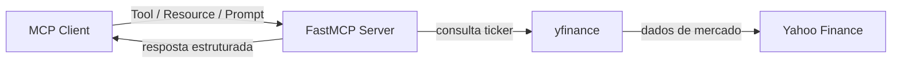

# Financial Analyst MCP Server

[](https://www.python.org/)
[](https://github.com/jlowin/fastmcp)
[](https://pypi.org/project/yfinance/)

Servidor MCP (Model Context Protocol) para analise financeira, construido com FastMCP e alimentado por dados do Yahoo Finance via `yfinance`.

## Why This Project

Este servidor expoe capacidades financeiras prontas para uso em clientes MCP:

- Tool para preco em tempo real
- Resource estruturado com metricas de mercado
- Prompt para gerar resumo financeiro rapido

## Features

| Capability | Nome | Entrada | Saida |
| --- | --- | --- | --- |
| Tool | `get_stock_price` | `ticker: str` | `float` |
| Resource | `stock://{ticker}` | `ticker` na URI | JSON serializado |
| Prompt | `financial_report` | `ticker: str` | `str` |

Tickers de exemplo: `AAPL`, `MSFT`, `PETR4.SA`.

## Architecture



## Project Structure

```text
mcp_server/
  main.py
  README.md
  requirements.txt
```

## Requirements

- Python 3.10+
- Dependencias em `requirements.txt`

## Quickstart

1. Criar e ativar ambiente virtual:

```powershell
python -m venv .venv
.\.venv\Scripts\Activate.ps1
```

2. Instalar dependencias:

```powershell
pip install -r requirements.txt
```

3. Executar o servidor:

```powershell
fastmcp run main.py
```

Se `fastmcp` nao estiver no PATH:

```powershell
python -m fastmcp run main.py
```

## MCP Endpoints

### Tool: `get_stock_price(ticker: str) -> float`

Busca o preco atual de um ticker. Se o dado nao estiver disponivel, retorna erro explicito.

### Resource: `stock://{ticker}`

Retorna JSON com os campos:

- `ticker`
- `currentPrice`
- `previousClose`
- `open`
- `dayHigh`
- `dayLow`

### Prompt: `financial_report(ticker: str) -> str`

Gera um resumo textual contendo:

- nome da empresa
- setor
- industria
- preco atual

## Notes

- Os dados dependem da disponibilidade da API do Yahoo Finance.
- Alguns tickers podem nao retornar `currentPrice` dependendo do mercado e horario.
